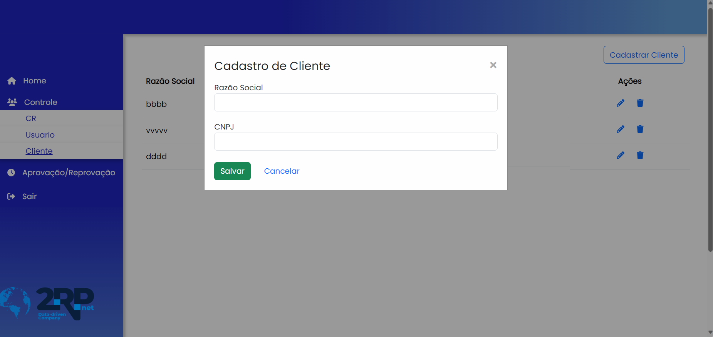

# Coloque seu nome aqui
Luciano do Nascimento Pamplona da Silva 

## Introdução

Olá, sou o Luciano, atualmente estudante de Banco de Dados na Fatec São José dos Campos, com formação anterior em Manufatura Avançada. Desde 2019, venho desenvolvendo projetos para empresas, principalmente no âmbito acadêmico. Atualmente, estou engajado na área da educação, onde atuo auxiliando crianças e adolescentes no desenvolvimento das matérias.

## Contatos
* [GIT](https://github.com/lucianonps)
* [LinkedIn](https://www.linkedin.com/in/luciano-pamplona)

## Meus Principais Conhecimentos
Minhas habilidades principais incluem:
•	Domínio em Vue.js (HTML, JavaScript, CSS).
•	Experiência em banco de dados relacional (MySQL).
•	Proficiência em Spring Boot (Java).
•	Conhecimento em Figma.

## Meus Projetos

### Em 2021-2
O projeto envolve a criação de um sistema para controlar a jornada de trabalho dos colaboradores, capaz de identificar e classificar horas extras, além de gerenciar o registro e controle dessas horas extras e sobreavisos. Um dos principais desafios que a empresa enfrentava era a dificuldade em registrar com precisão as horas extras dos colaboradores. Para resolver essa questão, optamos por desenvolver um aplicativo capaz de registrar de forma abrangente as horas trabalhadas e que possa ser monitorado pela empresa.
A empresa parceira é a 2RP, reconhecida por sua atuação na análise de transações financeiras e de dados.

[GIT](https://github.com/api-3sem-pixel-api/api)

#### Tecnologias Utilizadas

•	Spring Boot: É um framework para o desenvolvimento de aplicativos Java que facilita a criação de aplicativos robustos e escaláveis.
•	Java: É uma das linguagens de programação mais populares e amplamente utilizadas. É conhecida por sua portabilidade, robustez e segurança
•	MySQL: É um sistema de gerenciamento de banco de dados relacional (RDBMS) de código aberto amplamente utilizado. É conhecido por sua confiabilidade, desempenho e facilidade de uso.
•	Vue.js: É um framework JavaScript progressivo utilizado para construir interfaces de usuário interativas e dinâmicas. Vue.js é apreciado por sua simplicidade e flexibilidade, permitindo aos desenvolvedores criar aplicativos escaláveis com facilidade.
•	TypeScript: É um superset da linguagem JavaScript que adiciona recursos de tipagem estática opcional e outros recursos avançados
•	CSS : É uma linguagem de estilo utilizada para definir a apresentação de documentos HTML.

#### Contribuições Pessoais
Apresente suas contribuições no projeto. Foque nas funcionalidades em que você mais atuou. Descreva sua atuação em detalhes, especificando que tecnologias você utilizou.

-Nesse projeto atuei no:

•	Frontend: utilizando as tecnologias de vue e typescrip ;
•	Figma;

-Cadastro de cliente: 
•	Desenvolvi a tela de cadastro de cliente, que foi implementada em forma de um modal no qual os dados, como CNPJ e razão social, eram preenchidos. Para a realização desse modal, foram necessárias comunicação HTTP e criação de layout.

  

 Saiba mais 

<imagem src= "C:\Users\lucia\OneDrive - Fatec Centro Paula Souza\Pictures\Screenshots\Captura de tela 2023-10-15 152036.png">

A imagem acima refere-se a um modal para cadastrar clientes. Nele, preencheremos o CNPJ e a razão social para cadastrar a empresa no sistema.

#### Hard Skills
Apresente as hard skills que você utilizou/desenvolveu durante o projeto e o nível de proficiência alcançado. Exemplo: CSS - Sei fazer com autonomia

#### Soft Skills
Apresente as soft skills que você utilizou/desenvolveu durante o projeto e em quais situações elas foram fundamentais. Exemplo: Comunicação - Precisei exercitar minhas habilidades de comunicação para viabilizar as reuniões semanais levando em conta as disponibilidades dos membros, que não cursavam as mesmas disciplinas.

### Em 2022-1
Mesmo formato

### Em 2022-2
Mesmo formato

### Em 2023-1
Mesmo formato

### Em 2023-2
Mesmo formato

